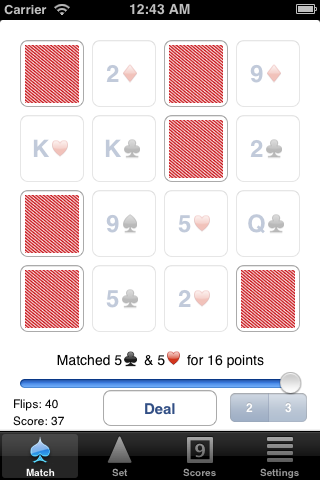
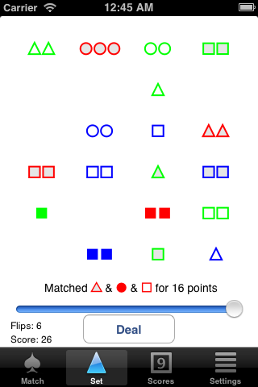
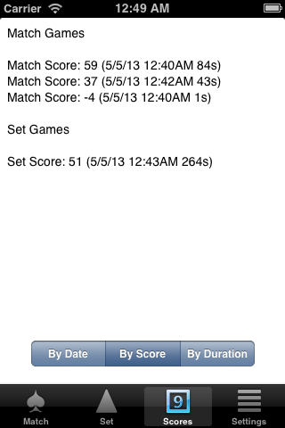

Matchismo Card Game 
===================

This is my version of the Matchismo Card Game of the Standford University CS193P course. The project is driven by requirements defined in course assignments. One of the key feature of my version is that it's driven by tests from the beginning rather than simply writing code.

Here is also other major features of this implementation.

## Features
- fully test-driven model logic (each time something is being implemented the test written first)
- granular commits - step by step addition of each little feature
- easy navigation through significant updates with useful tags (e.g. lecture2-hw, lecture3-slides)
- the match logic is universal for n-number of cards (2,3-card game is just an example) and still simple using simple formula (yes - math is good)

## Screenshots

Card Match Game

Set Game

Game Scores

## Release Notes

### Assignment 2 Release: 27 April 2013
Main feature of this release is a Set Card Game support including following features:

 - Full Set Card Game logic
 - The set card and last flip result displayed using attributes of the NSAttributedString
 - In a set game cards disappear when set picked to reduce distraction
 - We use two views, but share base logic of Match game using inheritance of the set card game controller from the base (match) card game controller.

### Assignment 1 + Extra Credit Release: 1 April 2013
Fully-working Matchismo Assignment 1 implemented with all required tasks and extra credit, including:

 - Game play with 16 cards
 - Description of the last flip result, e.g. cards match or just flip of the card.
 - Easily start new game with "Deal" button
 - Selection of either 2-card matching or 3-card matching game.
 - Nice card design with custom image as back of the card.
 - **Extra Credit** Flip history with UI to slide through past flips

### Lecture 5 - Slides Game Score model & tab: 7 April 2013
 - Implemented GameResult class with logic for storing game results and synchronizing it to NSUserDefaults.
 - Added tabbed interface to switch between Game and Scores.
 - Scores can be sorted by date, score and duration.

Notice: The Assignment 2 starts with notice that we should use our Assignment 1 code as base. So the question is do we really need to start from Assignment 1 and throw temporarily our Lecture 5: Game Score Implementation or keep our Game Score Tab? Since the Assignment 2 has Game Score Tab as Extra Credit Task 2 we will keep this functionality and start Assignment 2 with it rather than from the Assignment 1 code (which doesn't have Scores Tab).